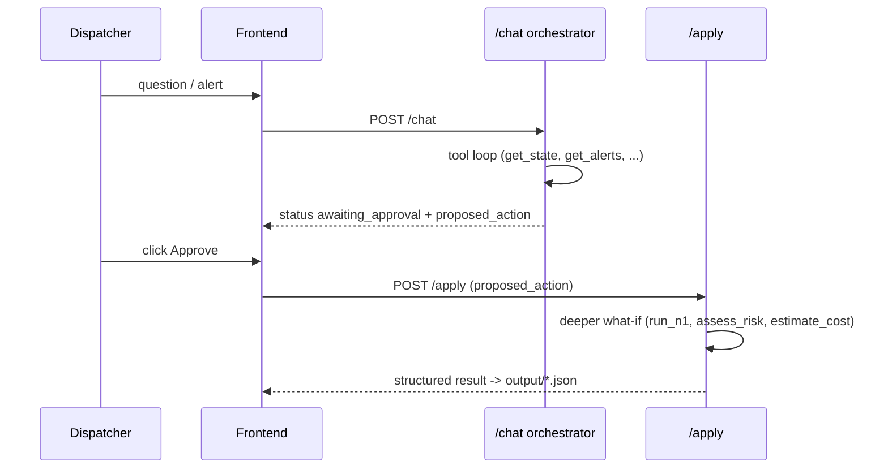

# Grid Pulse - full build plan

Builds the MVP from [Grid_Pulse_MVP_plan.md](Grid_Pulse_MVP_plan.md) on the real IEEE-118 ČEPS dataset, reusing the visual language of the existing [grid_pulse_city_demo.html](grid_pulse_city_demo.html).

## Assumptions (confirmed by your instructions)

- Data target = hybrid: the backend computes for real on the IEEE-118 data (118 buses, regions `r1`/`r2`/`r3`, 8760 snapshots); the map is drawn from the real `bus_coordinates.csv`, keeping the polish of the existing demo. The fictional Voltava City stays only as a styling reference.
- Stack: backend = Python + FastAPI + pandapower (forced, pandapower is Python-only); frontend = Next.js + TypeScript + Tailwind (per your coding rules: no semicolons, fetch, date-fns, British spelling, sentence case).
- Data layer = file-based, NO database. Read dataset files (under `greenhack-2026-ČEPS-dataset/`) and the existing root JSON shapes ([grid_state.json](grid_state.json), [alerts.json](alerts.json)) on demand, keep results in memory. No DuckDB, no Parquet. Keep JSON shapes exactly as-is, no reshaping/migration.
- Computed results (state, alerts, n1, risk verdict, shift summary) are ALSO written as JSON files into an `output/` folder.
- Forecasts = the dataset's day-ahead MW forecasts (Load per region, Solar/Wind per generator) ARE the predictive signal; the weather effect is already baked in. NO external weather/satellite/cloud APIs. Forecast-driven alerts compare upcoming forecast MW against current state and limits.
- LLM = Gemini via its OpenAI-compatible endpoint using the `openai` SDK, driven by env vars `LLM_BASE_URL`, `LLM_MODEL`, `LLM_API_KEY`. Default `gemini-3-flash` (free tier, supports tool calling); optional `gemini-2.5-pro` for final demo runs only (50 req/day). Groq and Ollama documented as drop-in fallbacks (same interface, only env vars change). Mock fallback when no key is present, so nothing breaks.
- Hard rule baked into the system prompt: every number must come from a tool call, never invented.
- Secrets: API key lives ONLY in a gitignored `.env`; commit `.env.example` (same keys, empty `LLM_API_KEY`). Key shared out-of-band between the 2 developers, never via the repo. `config.py` loads env via `python-dotenv` and fails with a clear message if no key AND not in mock mode.
- Scope = phased: get one scenario working end to end first (state -> N-1 -> alerts -> map), then layer LLM, agentic upgrades, FAISS analogues and shift summary.
- The `greenhack-2026-ČEPS-dataset/` folder, `.env` and `output/` stay gitignored.
- Tests-first per your rules: write pytest cases for each backend module before implementing, including a mock-provider test that runs the tool-calling loop with no real API key.

## What the dataset actually gives us

- `static/`: `buses.csv` (118 buses, region, kV, v limits, coords), `branches.csv` (186 lines/trafos with `max_i_ka`, `r/x/b`, `trafo_ratio_rel`), `gens.csv` (321 gens, `opt_category`, P limits), `loads.csv`, `bus_coordinates.csv`.
- `realtime/`: `gens_ts.csv` (~2.8M rows), `loads_ts.csv` (~0.8M rows) - hourly for the full year.
- `forecasts/DA/`: `Load/LoadR{1,2,3}DA.csv` (per region), `Solar/Solar*DA.csv`, `Wind/Wind*DA.csv` (per generator) - day-ahead hourly.
- `other/Fuel prices 2024.csv`: monthly price per fuel type and region -> generator variable cost -> Kč economics.
- `snapshots/`: 8760 pandapower JSON files (~200 KB each), each a solved load flow. Load with `pp.from_json(...)`; results (`res_line.loading_percent`, `res_bus.vm_pu`) are already inside.

## Architecture

```mermaid
flowchart LR
  subgraph files [Dataset + JSON files - read on demand]
    snaps[snapshots JSON]
    fc[DA forecasts MW]
    rootjson[grid_state.json + alerts.json]
  end
  subgraph backend [FastAPI backend - Python]
    loader["grid.loader (LRU cache)"] --> state[grid.state]
    state --> contingency[grid.contingency N-1]
    state --> alerts[analysis.alerts]
    fc --> alerts
    fuel[economics] --> alerts
    orch[llm.orchestrator tool-loop] --> state
    orch --> contingency
    orch --> alerts
    risk[assess_risk sub-agent] --> contingency
    risk --> analogues[analysis.analogues optional FAISS]
    risk --> fuel
    glossary[llm/glossary.json] --> orch
  end
  subgraph hil [Human-in-the-loop]
    chat["/chat -> awaiting_approval + proposed_action"] --> approve[frontend Approve]
    approve --> apply["/apply runs deeper what-if"]
  end
  subgraph out [output/ JSON files]
    ostate[state.json] 
    oalerts[alerts.json]
    on1[n1.json]
    orisk[risk.json]
    oshift[shift_summary.json]
  end
  subgraph frontend [Next.js + Tailwind]
    map[GridMap] --> api[lib/api]
    kpis[KpiTiles] --> api
    panel[AlertsPanel + AiSummary + ChatBox] --> api
  end
  snaps --> loader
  rootjson --> state
  state --> ostate
  alerts --> oalerts
  contingency --> on1
  risk --> orisk
  orch --> chat
  api --> orch
  api --> state
  api --> apply
```

## Proposed repo structure

- `backend/app/main.py` - FastAPI app + routes (`/state`, `/alerts`, `/n1`, `/analogues`, `/chat`, `/apply`, `/assess`, `/summary`)
- `backend/app/config.py` - dataset paths, thresholds (line 80%, trafo 90%, v 0.95-1.05), `output/` path; loads env via `python-dotenv`; fails clearly if no `LLM_API_KEY` and not in mock mode
- `backend/app/grid/loader.py` - load a snapshot by datetime (`pp.from_json`), wrapped in an `lru_cache` so pandapower is not re-run within a conversation
- `backend/app/grid/state.py` - network state: per-branch loading, per-bus voltage, region balances, binding constraint; also writes `output/state.json`
- `backend/app/grid/contingency.py` - N-1: set element out, `runpp`, report overloads; writes `output/n1.json`
- `backend/app/grid/features.py` - hourly feature vector for analogues (load, gen mix, region balance, key-branch loading, hour/season)
- `backend/app/analysis/alerts.py` - threshold + forecast-driven alerts (compares upcoming DA MW vs limits); same JSON shape as existing [alerts.json](alerts.json); writes `output/alerts.json`
- `backend/app/analysis/analogues.py` - optional in-memory FAISS k-NN over hours -> "what happened next" (stretch)
- `backend/app/analysis/economics.py` - fuel-price-based cost / avoided-cost estimates in Kč
- `backend/app/llm/glossary.json` - the single source of truth for terminology (moved from repo root; see LLM module section)
- `backend/app/llm/provider.py` - `openai` SDK pointed at `LLM_BASE_URL`; mock provider when no key
- `backend/app/llm/tools.py` - OpenAI-style function/tool schemas wrapping grid/analysis functions
- `backend/app/llm/orchestrator.py` - tool-calling loop (capped iterations), glossary injected into system prompt, `assess_risk` sub-agent, deterministic shift summary
- `backend/app/schemas.py` - pydantic models (state, alert, n1, risk verdict, chat status) reused by frontend types
- `backend/{requirements.txt,README.md}`, `backend/.env.example`, and `backend/tests/` (pytest)
- `output/` - generated JSON results (gitignored)
- `frontend/app/{page.tsx,layout.tsx}` + `frontend/components/{GridMap,KpiTiles,AlertsPanel,AiSummary,ChatBox,NodeInspector}.tsx` + `frontend/lib/api.ts`
- root `README.md` (kept up to date as we go), `.gitignore`

> Note: the existing root `glossary.json` becomes `backend/app/llm/glossary.json` (one source of truth). The optional FAISS analogues are built in-memory at startup if enabled - no DuckDB/Parquet anywhere.

## LLM module (detailed - this is the focus of this update)

- `glossary.json` (provided, do NOT regenerate): sections `schema`, `results`, `domain`, `units`, `czech`. It is moved to `backend/app/llm/glossary.json` as the one source of truth and injected verbatim into the system prompt so the model reads column names, units and jargon correctly. Definitions come only from this file.
- `provider.py`:
  - Real provider = `openai.OpenAI(base_url=LLM_BASE_URL, api_key=LLM_API_KEY)`, model `LLM_MODEL`. Defaults target Gemini's OpenAI-compatible endpoint.
  - `MockProvider` returns deterministic scripted tool calls + final text so the orchestrator loop is fully testable with no key.
  - Selection: mock if `LLM_API_KEY` is unset/empty, else real.
- `tools.py` - OpenAI-style function schemas + dispatch to Python: `get_state(datetime)`, `run_n1(datetime, element)`, `get_alerts(datetime)`, `find_analogues(datetime)`, `estimate_cost(action)`, `get_forecast(datetime, horizon_h)`. Each returns structured JSON (never prose).
- `orchestrator.py`:
  - System prompt = glossary + hard rule "every number must come from a tool call, never invented" + role framing (dispatcher assistant).
  - Tool-calling loop with a hard iteration cap (e.g. 6) to avoid runaway loops.
  - `get_state` results cached via the loader `lru_cache` so pandapower is not re-run within a conversation.
  - Human-in-the-loop: `/chat` may return `{ "status": "awaiting_approval", "proposed_action": {...} }`; the deeper what-if only runs after `/apply`.
  - `assess_risk(datetime, element)` sub-agent: a focused prompt given ONLY `run_n1` + `find_analogues` + `estimate_cost`, returns a STRUCTURED JSON risk verdict (exposed at `/assess`, written to `output/risk.json`).
  - Shift summary stays DETERMINISTIC: gather alerts + events for the 12h window from the in-memory file-loaded data, then a single LLM `summarise` call (not an agentic loop); written to `output/shift_summary.json`.

## Agentic flow

## Secrets / env (2 devs, single shared key)

- `backend/.env` (gitignored): `LLM_BASE_URL`, `LLM_MODEL`, `LLM_API_KEY`.
- `backend/.env.example` (committed): same keys, empty `LLM_API_KEY`, default `LLM_BASE_URL=https://generativelanguage.googleapis.com/v1beta/openai/`, `LLM_MODEL=gemini-3-flash`.
- `.gitignore` adds `.env`, `greenhack-2026-ČEPS-dataset/`, `output/`.
- README: copy `.env.example` to `.env`, paste the shared Gemini key (shared privately, never via repo); documents Groq/Ollama fallback env values and the `gemini-2.5-pro` 50 req/day caveat.

## Files to create/edit in this LLM pass

- Edit: this plan (done), root `README.md` env section.
- Add/edit: `backend/requirements.txt` (`openai`, `python-dotenv`, plus `fastapi`, `uvicorn`, `pandapower`, `pandas`, `pytest`), `backend/app/config.py`, `backend/app/llm/provider.py`, `backend/app/llm/orchestrator.py`, `backend/app/llm/tools.py`, `backend/app/llm/glossary.json` (the provided file), `backend/app/schemas.py`, `backend/.env.example`, `.gitignore`.
- Tests first: `backend/tests/test_provider_mock.py` (tool-calling loop with mock provider, no key), `test_tools.py`, `test_orchestrator.py`, `test_assess_risk.py`, `test_shift_summary.py`.

## Build phases

1. Scaffold backend + frontend, pin deps, set up `.env.example` + `.gitignore` + `output/`.
2. Tests-first then implement `grid.loader` (+ `lru_cache`) + `grid.state`; expose `/state`, write `output/state.json`. Verify against a known snapshot.
3. `grid.contingency` N-1 (on-demand for a chosen element) -> `/n1`, write `output/n1.json`.
4. `analysis.alerts` + `analysis.economics` (forecast MW vs limits) -> `/alerts` in the existing JSON shape, write `output/alerts.json`.
5. LLM module: tests-first (mock provider) then `provider.py` + `tools.py` + `orchestrator.py` with glossary injection -> `/chat`. Add `/apply` (HIL approval), `/assess` (risk sub-agent), deterministic `/summary`.
6. Frontend dashboard: map from real `bus_coordinates`, branches coloured by loading, KPI tiles, alerts panel, node inspector, ChatBox with Approve button, AiSummary.
7. Stretch: in-memory FAISS feature build -> `/analogues` and the "in 80% of similar hours X overloaded in 15 min" widget.
8. Polish one end-to-end demo scenario (peak hour with a transformer/branch near limit) and update root `README.md`.

## Open risks

- Full N-1 over 186 branches per request is slow; do on-demand single-element N-1 live (one `runpp`) and keep results in the LRU cache.
- 8760 snapshots (~1.8 GB) - read only the requested snapshot on demand; never scan all snapshots at request time. Optional FAISS index is built in-memory once at startup if enabled.
- Free-tier Gemini quota (esp. `gemini-2.5-pro` 50 req/day) can be exhausted; mock provider + Groq/Ollama fallback keep the demo running.
- "Planned outages" referenced in the brief are not in the data; alerts that need outages will be derived from `in_service` flags in snapshots instead.
