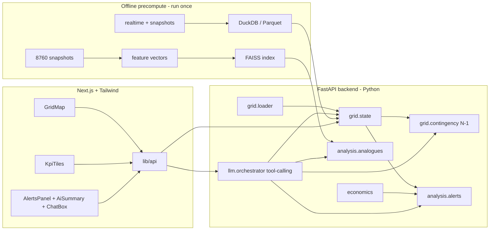

# Grid Pulse - full build plan

Builds the MVP from [Grid_Pulse_MVP_plan.md](Grid_Pulse_MVP_plan.md) on the real IEEE-118 ČEPS dataset, reusing the visual language of the existing [grid_pulse_city_demo.html](grid_pulse_city_demo.html).

## Assumptions (you skipped the questions, so these are my defaults - tell me to change any)

- Data target = hybrid: the backend computes for real on the IEEE-118 data (118 buses, regions `r1`/`r2`/`r3`, 8760 snapshots); the map is drawn from the real `bus_coordinates.csv`, keeping the polish of the existing demo. The fictional Voltava City stays only as a styling reference.
- Stack: backend = Python + FastAPI + pandapower (forced, pandapower is Python-only); frontend = Next.js + TypeScript + Tailwind (per your coding rules: no semicolons, fetch, date-fns, British spelling, sentence case).
- LLM = provider-agnostic with a mock fallback; default Anthropic Claude via `ANTHROPIC_API_KEY` env var. Nothing breaks if no key is present.
- Scope = phased: get one scenario working end to end first (state -> N-1 -> alerts -> map), then layer LLM, FAISS analogues and shift summary.
- The `greenhack-2026-ČEPS-dataset/` folder stays gitignored (already is). Derived artefacts also gitignored.
- Tests-first per your rules: write pytest cases for each backend module before implementing.

## What the dataset actually gives us

- `static/`: `buses.csv` (118 buses, region, kV, v limits, coords), `branches.csv` (186 lines/trafos with `max_i_ka`, `r/x/b`, `trafo_ratio_rel`), `gens.csv` (321 gens, `opt_category`, P limits), `loads.csv`, `bus_coordinates.csv`.
- `realtime/`: `gens_ts.csv` (~2.8M rows), `loads_ts.csv` (~0.8M rows) - hourly for the full year.
- `forecasts/DA/`: `Load/LoadR{1,2,3}DA.csv` (per region), `Solar/Solar*DA.csv`, `Wind/Wind*DA.csv` (per generator) - day-ahead hourly.
- `other/Fuel prices 2024.csv`: monthly price per fuel type and region -> generator variable cost -> Kč economics.
- `snapshots/`: 8760 pandapower JSON files (~200 KB each), each a solved load flow. Load with `pp.from_json(...)`; results (`res_line.loading_percent`, `res_bus.vm_pu`) are already inside.

## Architecture

## Proposed repo structure

- `backend/app/main.py` - FastAPI app + routes (`/state`, `/alerts`, `/n1`, `/analogues`, `/chat`, `/summary`)
- `backend/app/config.py` - dataset paths, thresholds (line 80%, trafo 90%, v 0.95-1.05)
- `backend/app/grid/loader.py` - load a snapshot by datetime (`pp.from_json`)
- `backend/app/grid/state.py` - network state: per-branch loading, per-bus voltage, region balances, binding constraint
- `backend/app/grid/contingency.py` - N-1: set element out, `runpp`, report overloads
- `backend/app/grid/features.py` - hourly feature vector (load, gen mix, region balance, key-branch loading, hour/season)
- `backend/app/analysis/alerts.py` - threshold + forecast-driven alerts (shape matches existing [alerts.json](alerts.json))
- `backend/app/analysis/analogues.py` - FAISS k-NN over hours -> "what happened next"
- `backend/app/analysis/economics.py` - fuel-price-based cost / avoided-cost estimates in Kč
- `backend/app/llm/{orchestrator.py,tools.py,provider.py,glossary.json}` - tool-calling loop, provider abstraction + mock, abbreviation glossary in the prompt
- `backend/app/schemas.py` - pydantic models reused by the frontend types
- `backend/scripts/{build_history.py,build_features.py}` - offline precompute -> `backend/data_derived/` (gitignored)
- `backend/{requirements.txt,README.md}` and `backend/tests/` (pytest)
- `frontend/app/{page.tsx,layout.tsx}` + `frontend/components/{GridMap,KpiTiles,AlertsPanel,AiSummary,ChatBox,NodeInspector}.tsx` + `frontend/lib/api.ts`
- `shared/glossary.json`, root `README.md` (kept up to date as we go)

## Build phases

1. Scaffold backend + frontend, pin deps, gitignore derived data.
2. Tests-first then implement `grid.loader` + `grid.state`; expose `/state`. Verify against a known snapshot.
3. `grid.contingency` N-1 (on-demand for a chosen element) -> `/n1`.
4. `analysis.alerts` + `analysis.economics` -> `/alerts` (same JSON shape the demo already consumes).
5. Frontend dashboard: map from real `bus_coordinates`, branches coloured by loading, KPI tiles, alerts panel, node inspector.
6. `llm.orchestrator` + tools + glossary, mock fallback -> `/chat` and `/summary`; wire ChatBox + AiSummary.
7. Stretch: offline feature build + FAISS -> `/analogues` and the "in 80% of similar hours X overloaded in 15 min" widget; shift summary.
8. Polish one end-to-end demo scenario (peak hour with a transformer/branch near limit) and update root `README.md`.

## Open risks

- Full N-1 over 186 branches per request is slow; do on-demand single-element N-1 live and precompute worst-case per snapshot offline for the alert engine.
- 8760 snapshots (~1.8 GB) - precompute features/history once into `data_derived/`, never read all snapshots at request time.
- "Planned outages" referenced in the brief are not in the data; alerts that need outages will be derived from `in_service` flags in snapshots instead.
